# 👋 Welcome to My Digital Universe!

<div align="center">
  
</div>

<div align="center">
  <h1>
    
  </h1>
  
  <h3>🚀 Passionate Frontend & Mobile Developer from Kerala, India 🇮🇳</h3>
  
  <p>
    
    
  </p>
</div>

---

## 🎯 About Me


```javascript
const jasir = {
    pronouns: "He/Him",
    location: "Kerala, India 🌴",
    currentRole: "Frontend Developer",
    company: "Tathkarah Travel And Tourism PVT LTD",
    code: ["JavaScript", "Dart", "Java", "C"],
    technologies: {
        frontEnd: ["HTML5", "CSS3", "Flutter"],
        mobileApp: ["Flutter", "Android"],
        tools: ["Git", "Figma", "VS Code"],
        architecture: ["Responsive Design", "Progressive Web Apps"]
    },
    currentFocus: "Building amazing mobile experiences with Flutter",
    funFact: "I code for fun, but I also have a knack for overthinking solutions!"
};
```

<br clear="right"/>

---

## 🛠️ Tech Arsenal

<div align="center">

### 💻 Languages


### 🚀 Frameworks & Tools


</div>

---

## 📊 GitHub Analytics

<div align="center">
  
  
</div>

<div align="center">
  
</div>

<div align="center">
  
</div>

---

## 🎯 Current Focus

```mermaid
graph TD
    A[🎯 Current Goals] --> B[Flutter Development]
    A --> C[UI/UX Design]
    A --> D[Problem Solving]
    B --> E[Cross-platform Apps]
    C --> F[User Experience]
    D --> G[LeetCode Challenges]
```

<div align="center">



</div>

- 🌱 **Currently Working:** Frontend Developer at Tathkarah Travel And Tourism PVT LTD
- 👨‍💻 **Portfolio:** [https://jasirpk.github.io/](https://jasirpk.github.io/)
- 💬 **Ask me about:** Android Development, Flutter, UI/UX Design
- 🎯 **2025 Goals:** Master advanced Flutter animations and contribute to open source
- ⚡ **Fun fact:** I debug my own thoughts as much as my code!

---

## 🌐 Let's Connect

<div align="center">

[](https://twitter.com/jasir_pk2440)
[](https://linkedin.com/in/jasir-pk)
[](https://instagram.com/jasirpk_396)
[](https://www.leetcode.com/jasir-pk)
[](mailto:jasir.techofficial@gmail.com)

</div>

---

## 💭 Quote of the Day

<div align="center">

*"The best way to predict the future is to create it."* 

**Let's build something amazing together! 🚀**

</div>

---

<div align="center">
  
</div>

<div align="center">
  <i>⭐️ From <a href="https://github.com/jasirpk">jasirpk</a> with ❤️</i>
</div>
